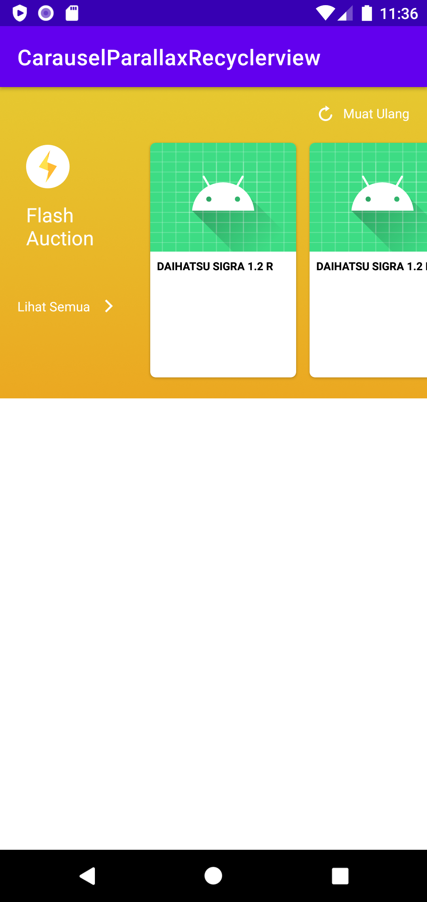

# SnapRecyclerviewTokped
Snap Horizontal Recyclerview Like Tokopedia Ecommers

## Screenshots

<p align="center">
  
  
  
  
</p>

## Cara Pake
- Clone aja project akuh
- di AndroidStudio pilih File -> New -> Import Module
- Arahin ke clone project akuh

### Buat BlankHorizontalScrollView di XML
Ganti Recyclerview kamu dengan klas yang akuh buat yaitu BlankHorizontalScrollView

```java
<com.blank.carauselparallaxrecyclerview.widget.BlankHorizontalScrollView
        android:id="@+id/rvItem"
        android:layout_width="match_parent"
        android:layout_height="match_parent"/>
```

### Pewarisan ke BlankSnapAdapter
Buat adapter trus extends nya ke BlankSnapAdapter ya kayak dibawah ini

```java
class AdapterKamuh : BlankSnapAdapter<AdapterKamuh.ViewHolderKamuh>() {

    override fun initViewHolder(parent: ViewGroup, viewType: Int): ViewHolder =
        ViewHolder(
            LayoutInflater.from(parent.context).inflate(R.layout.item_kamu, parent, false)
        )

    override fun ngeBindViewHolder(holder: ViewHolder, position: Int) {
        holder.itemView.setOnClickListener {
            Log.e("Posisi", position.toString())
        }
    }

    override fun itemCount(): Int = 10

    class ViewHolderKamuh(v: View) : RecyclerView.ViewHolder(v)
}
```

### Multi ViewType Di Library akuh
Panggil method multiViewType disitu kamu cek viewType viewType kamu, contohnya gini

```java
class AdapterKamuh : BlankSnapAdapter<RecyclerView.ViewHolder>() {

    private val viewTypeLihatSemua = 100
    private val viewTypeData = 110

    override fun initViewHolder(parent: ViewGroup, viewType: Int): RecyclerView.ViewHolder {
        return when (viewType) {
            viewTypeLihatSemua -> LihatSemuaViewHolder(
                LayoutInflater.from(parent.context).inflate(R.layout.item_lihatsemua, parent, false)
            )
            else -> ViewHolder(
                LayoutInflater.from(parent.context).inflate(R.layout.item_card_view, parent, false)
            )
        }
    }


    override fun ngeBindViewHolder(holder: RecyclerView.ViewHolder, position: Int) {
        holder.itemView.setOnClickListener {
            Log.e("Posisi", position.toString())
        }
    }

    override fun multiViewType(position: Int): Int {
        return when (position) {
            itemCount().minus(1) -> viewTypeLihatSemua
            else -> viewTypeData
        }
    }

    override fun itemCount(): Int = 10

    class ViewHolder(v: View) : RecyclerView.ViewHolder(v)
    class LihatSemuaViewHolder(v: View) : RecyclerView.ViewHolder(v)
}
```

- Trus kalo udah set adapter, panggil method addTransformsView dan masukin view view yang mau dikasih animasi
- Duar!! beres deh.

```java
class MainActivity : AppCompatActivity() {
    override fun onCreate(savedInstanceState: Bundle?) {
        super.onCreate(savedInstanceState)
        setContentView(R.layout.activity_main)

        val rv = findViewById<BlankHorizontalScrollView>(R.id.rvItem)
        val img = findViewById<ImageView>(R.id.icFlash)
        val txt = findViewById<TextView>(R.id.txtFlashAuction)
        val showMore = findViewById<LinearLayout>(R.id.btnLihatSemua)

        rv.apply {
            adapter = CardBgAdapter()
            addViewTransforms(img)
            addViewTransforms(txt)
            addViewTransforms(showMore)
        }
    }
}
```

## Fitur
- Snap Parallax Background Recyclerview
- Support Multi ViewType